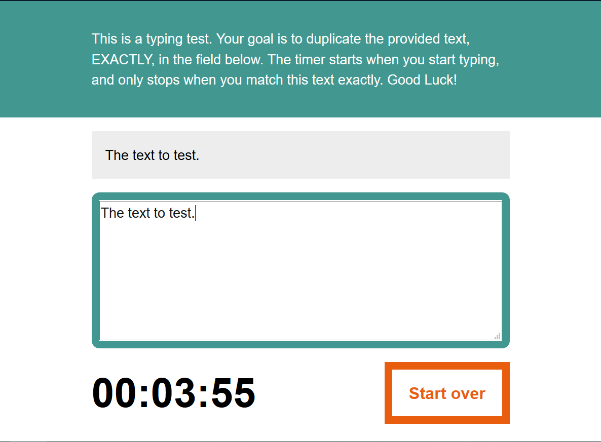

This is a course on JavaScript by Morten Rand-Hendriksen (https://www.lynda.com/JavaScript-tutorials/JavaScript-Essential-Training/574716-2.html).
The idea was to practice more JavaScript.

Accomplishments:

<ul>
    <li>Working with JavaScript and the DOM</li>
    <li>An Analog Clock Project</li>
    <li>A Typing Speed Tester Project</li>
    <li>Making images responsive using markup using loop</li>
    <li>Troubleshooting code JSHint and ESLint</li>
    <li>Minifying JavaScript</li>
</ul>

To run the Analog Clock, go to <b>Ex_Files_JavaScript_EssT\analogClock</b>, and open <b>index.html</b>with your favorite broswer.

To run the Typing Speed Test, go to <b>Ex_Files_JavaScript_EssT\typingSpeedTest</b>, and open <b>index.html</b>with your favorite broswer.

Date:8/14/2018
